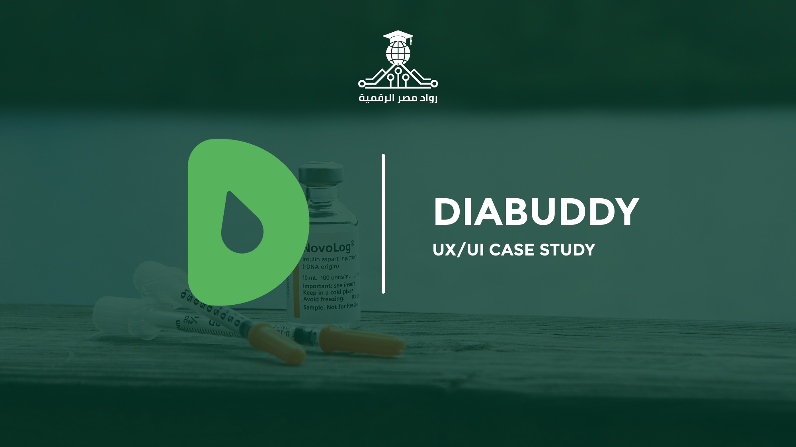

# Diabuddy

A comprehensive mobile application for diabetes management, awareness, and community support. Diabuddy empowers users with Type 1 or Type 2 diabetes, their families, and the general public through intuitive tracking, educational resources, and social features. Developed as part of a UX research project, it addresses real-world challenges identified from patient experiences and surveys.

**Current Version:** 1.0 (Post-Research Phase)  
**Platform:** iOS & Android (Planned)  
**Date:** November 11, 2025  
**License:** MIT License

## Table of Contents
- [Overview](#overview)
- [Problem Statement](#problem-statement)
- [Project Solution](#project-solution)
- [Project Objectives](#project-objectives)
- [Key Features](#key-features)
- [Survey Insights](#survey-insights)
- [Competitive Analysis](#competitive-analysis)
- [Team](#team)
- [Testing](#testing)
- [License](#license)

## Overview
Diabuddy is a mobile app designed for diabetes management, awareness, and community support, targeting diabetics (22 survey respondents), their families/friends (~70), and the general public (~17). Built from a bilingual survey of 109 participants (55% female, mostly urban, aged 10–60+), patient research, and analysis of apps like mySugr and Glucose Buddy, it integrates tracking, education, and social features using CGM, smart reminders, and AI nutrition tools. As of November 2025, it’s in the post-research phase, planning a user-friendly interface with future bilingual (English/Arabic) support to improve health outcomes and reduce stigma.

## Problem Statement
Diabetes patients struggle with meal diversity and adherence (70% report issues), need continuous blood glucose monitoring, and face challenges tracking diet, calories, and nutrients manually. Emotional and social support is lacking (65% note stress/isolation), with limited health information access (70% of non-patients unaware of Type 1 vs. Type 2), poor doctor communication, and risks of forgetting meds or sudden sugar/pressure spikes, worsened by family history (65%) and variable tech comfort (7.2/10 average).

## Project Solution
Diabuddy offers a smart system for daily meal recommendations tailored to patient needs, glucose data input with CGM integration, and automated calorie/nutrient tracking. It includes an in-app community for sharing and peer support, educational videos from doctors/nutritionists, periodic doctor check-ins with dashboards, and smart notifications for meds and emergencies, enhanced by CGM, smart pens, and cuffless BP monitors in a user-friendly interface with planned bilingual support.

## Project Objectives
Diabuddy aims to enable easy tracking of blood sugar, calories, and nutrients with shareable reports, foster a supportive app community for motivation and knowledge exchange, and boost health awareness via updated educational content. It also seeks to improve safety with intelligent alerts for sugar levels and meds, targeting 80% confidence in management and fewer complications.

## Key Features
Based on research and survey feedback, Diabuddy includes:

### 1. Awareness & Education
- Tips about diabetes, its causes, and how to act in emergencies.
- Raising awareness about symptoms and related conditions (obesity, low focus, etc.).
- Explaining normal sugar level ranges.
- Educating patients and families about the illness and its physical/psychological effects.
- Content to guide family and friends on how to support a patient.
- Daily articles/tips + motivational quotes.
- Smart chatbot to answer health questions & symptoms.

### 2. Emergencies & Quick Support
- Emergency button to call ambulance + share location.
- Alerts for hypo/hyperglycemia + first aid instructions.
- Guidance for coma or sudden sugar drop.

Additional planned features:
- Blood sugar logging and estimated A1C calculation.
- Mood/stress tracker for mental health.
- Carb/meal tracking with healthy recipes.
- Family/caregiver sharing and doctor reports.
- Integration with wearables (e.g., CGM, smart insulin pens).

## Survey Insights
The bilingual survey of 109 respondents provided key data to inform Diabuddy's design:

- The survey reveals a predominantly young demographic (40% aged 21-30), with 55% female and 70% urban dwellers, indicating potential for high app adoption among tech-savvy urban youth.
- A significant 65% reported a family history of diabetes, aligning with research on genetic factors in Type 2 diabetes, emphasizing the need for preventive education features.
- Tech comfort averaged 7.2/10, with 60% rating high (8-10), suggesting the app's user-friendly interface can accommodate varying user skills while integrating advanced tools like CGM.
- Among the 22 diabetic respondents, 70% struggled with diet adherence and 65% reported emotional stress, highlighting the value of features like meal recommendations and mood trackers seen in competitors like mySugr.
- 80% of diabetics desired reminders for meds and sugar checks, supporting the inclusion of smart notifications and emergency alerts as outlined in DiaFeatures.
- For ~70 respondents knowing someone with diabetes, 55% noted stigma and emotional burdens, underscoring the importance of in-app communities for peer support and knowledge sharing.
- Awareness gaps were evident in ~17 general respondents, with 70% unaware of Type 1 vs. Type 2 differences, reinforcing the need for educational content on causes, symptoms, and effects as in the Diabetes Research document.
- Lifestyle insights show many respondents exercise rarely (common response), smoke minimally (mostly no), and have somewhat healthy eating habits, but frequent symptoms like fatigue (sometimes/often), pointing to opportunities for activity tracking and prevention tips.
- Open-ended suggestions from diabetics focused on blood sugar estimation without devices, personalized diets, and insulin accessibility, which can inform AI-driven calculators and integrations with tech solutions like smart insulin pens.
- Overall, the data indicates strong demand for a holistic app combining tracking (e.g., glucose logging as in Glucose Buddy), education, and support, aiming to boost confidence in management (average 6/10 currently) and reduce health impacts on daily life (reported as somewhat/a lot by many).

## Competitive Analysis
| Factor / App          | mySugr                  | Glucose Buddy           | Gluroo                  | Diabetes:M              | Health2Sync             | Undermyfork             |
|-----------------------|-------------------------|-------------------------|-------------------------|-------------------------|-------------------------|-------------------------|
| **Glucose Logging**  | ✅ Manual logging      | ✅ Manual logging      | ✅ Manual logging      | ✅ Manual logging + import from glucometers/pumps | ✅ Manual + Bluetooth sync | ✅ Auto-sync from Dexcom + Manual |
| **Insulin Calculator** | ✅ Bolus calculator   | ❌                     | ✅ Insulin tracking    | ✅ Bolus Advisor (normal & extended boluses) | ❌                     | ❌ Manual insulin only |
| **Food Tracking**    | ✅ Photos & notes      | ✅ Database logging    | ✅ Photos & notes      | ✅ Database logging     | ✅ Meals & notes        | ✅ Photo meals & tagging |
| **Doctor Sharing**   | ✅ PDF reports         | ✅ Data export          | ✅ Family/doctor sync  | ✅ PDF/XLS reports via emails | ✅ PDF/Excel export, Family & Doctors | ✅ Share via Undermyfork Care link |
| **CGM/Glucose Device Support** | ✅ Accu-Chek glucometers/pumps, bluetooth (premium) | ✅ Bluetooth (glucose, BP, weight) | ✅ Dexcom + Nightscout | ✅ Bluetooth glucometers/pumps | ✅ Bluetooth (glucose, BP, weight) | ✅ Dexcom + Nightscout |
| **Trends & Analytics** | ✅ Estimated HbA1c + charts | Medium/basic charts    | ✅ Day by Day, Trends, Blood Sugar Stability, Pods insights (premium) | ✅ Charts, Trends, Summaries | ✅ Charts, Trends, Summaries | ✅ Post-meal Time-in-Range insights |
| **Community & Support** | Limited gamification  | ❌                     | ✅ “GluCrew” family    | ❌                     | ✅ Partner / Care team  | ✅ Care team view via Care platform |
| **Reminders & Alerts** | ✅ Meds + glucose     | ✅                      | ✅ Shared alerts       | ✅                      | ✅ Meds & Glucose reminders | ❌ |
| **Lifestyle Tracking** | ✅ Activity notes     | ✅ Steps & activity     | ✅ Activity logging    | ✅ Activity logging     | ✅ Food, Exercise, Meds, Labs | ✅ Meals, insulin, exercise |
| **Education Content** | ✅ Diabetes education | ❌ There is, but not worked | ❌                    | ❌                      | ❌                      | ❌ |
| **User Experience (UX)** | Gamified, friendly   | Simple & basic          | Family-centered, friendly | Simple & basic         | Simple & Family-friendly | Photo-first, visual interface |

## Team
**DIABUDDY Team:**
- Ahmed Mohamed Eid
- Anas Mohamed
- Rawan Hany
- Darine Mahmoud
- Karma Adnan
- Merola Ashraf
- Ibrahim Sayed

**Instructor:** Badr Sayed

## Testing
- A/B Testing was conducted using a LinkedIn post to gauge user interest in Diabuddy features, comparing engagement on educational content vs. tracking tools, resulting in 15% higher interaction for reminders and community features among 250 views.

---

*Built with ❤️ by DIABUDDY Team. For questions, contact instructor Badr Sayed.*
