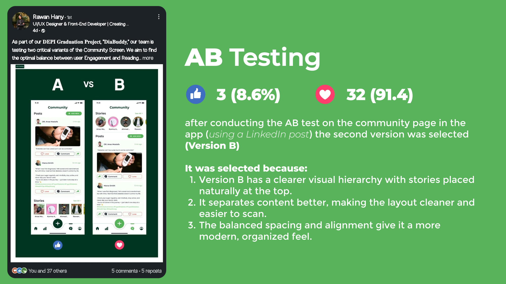

# Diabuddy

A comprehensive mobile application for diabetes management, awareness, and community support. Diabuddy empowers users with Type 1 or Type 2 diabetes, their families, and the general public through intuitive tracking, educational resources, and social features. Developed as part of a UX research project, it addresses real-world challenges identified from patient experiences and surveys.
## Table of Contents
- [Overview](#overview)
- [Problem Statement](#problem-statement)
- [Project Solution](#project-solution)
- [Project Objectives](#project-objectives)
- [Key Features](#key-features)
- [Survey Insights](#survey-insights)
- [Competitive Analysis](#competitive-analysis)
- [Team](#team)
- [Testing](#testing)
- [License](#license)
## Overview
Diabuddy is a mobile app designed for diabetes management, awareness, and community support, targeting diabetics (22 survey respondents), their families/friends (~70), and the general public (~17). Built from a bilingual survey of 109 participants (55% female, mostly urban, aged 10–60+), patient research, and analysis of apps like mySugr and Glucose Buddy, it integrates tracking, education, and social features using CGM, smart reminders, and AI nutrition tools. As of November 2025, it’s in the post-research phase, planning a user-friendly interface with future bilingual (English/Arabic) support to improve health outcomes and reduce stigma.
## Problem Statement
Diabetes patients struggle with meal diversity and adherence (70% report issues), need continuous blood glucose monitoring, and face challenges tracking diet, calories, and nutrients manually. Emotional and social support is lacking (65% note stress/isolation), with limited health information access (70% of non-patients unaware of Type 1 vs. Type 2), poor doctor communication, and risks of forgetting meds or sudden sugar/pressure spikes, worsened by family history (65%) and variable tech comfort (7.2/10 average).
## Project Solution
Diabuddy offers a smart system for daily meal recommendations tailored to patient needs, glucose data input with CGM integration, and automated calorie/nutrient tracking. It includes an in-app community for sharing and peer support, educational videos from doctors/nutritionists, periodic doctor check-ins with dashboards, and smart notifications for meds and emergencies, enhanced by CGM, smart pens, and cuffless BP monitors in a user-friendly interface with planned bilingual support.
## Project Objectives
Diabuddy aims to enable easy tracking of blood sugar, calories, and nutrients with shareable reports, foster a supportive app community for motivation and knowledge exchange, and boost health awareness via updated educational content. It also seeks to improve safety with intelligent alerts for sugar levels and meds, targeting 80% confidence in management and fewer complications.
## Key Features
Based on research and survey feedback, Diabuddy includes:
### 1. Awareness & Education
- Tips about diabetes, its causes, and how to act in emergencies.
- Raising awareness about symptoms and related conditions (obesity, low focus, etc.).
- Explaining normal sugar level ranges.
- Educating patients and families about the illness and its physical/psychological effects.
- Content to guide family and friends on how to support a patient.
- Daily articles/tips + motivational quotes.
- Smart chatbot to answer health questions & symptoms.
### 2. Emergencies & Quick Support
- Emergency button to call ambulance + share location.
- Alerts for hypo/hyperglycemia + first aid instructions.
- Guidance for coma or sudden sugar drop.
Additional planned features:
- Blood sugar logging and estimated A1C calculation.
- Mood/stress tracker for mental health.
- Carb/meal tracking with healthy recipes.
- Family/caregiver sharing and doctor reports.
- Integration with wearables (e.g., CGM, smart insulin pens).
## Survey Insights
### Enhanced Survey Insights

The bilingual (English/Arabic) survey collected responses from 109 participants between August 25 and September 1, 2025, informing Diabuddy's design with data-driven priorities. Responses highlight opportunities for personalized tracking, emotional support, and education, aligning with the app's goals of improving management confidence (currently averaging 5.2/10 among diabetics) and addressing gaps in awareness and adherence. Below is a detailed breakdown, including demographics, key behaviors, challenges, and feature demands.

#### Demographics
The sample skews young, urban, and female, suggesting strong potential for app adoption in tech-accessible populations while needing inclusive design for older/rural users.

| Category          | Breakdown                                                                 | Percentage |
|-------------------|---------------------------------------------------------------------------|------------|
| **Age Group**    | 10-20: 39; 21-30: 36; 31-40: 10; 41-50: 7; 51-60: 15; 61-70: 2          | 36% (10-20); 33% (21-30); 14% (51-60) |
| **Gender**       | Female: 65; Male: 44                                                      | 60% Female |
| **Location**     | Urban: 100; Rural: 9                                                      | 92% Urban  |
| **Family History of Diabetes** | Yes: 60; No: 38; Maybe: 11                                      | 55% Yes    |

#### Technology Comfort & App Readiness
Participants rated health app comfort on a 1-5 scale (data entry capped at 5; intended 1-10), averaging **3.0/5**—indicating moderate familiarity but room for intuitive UX. High comfort (4-5) was reported by 28%, while 29% rated low (1-2).

| Rating | Count | Percentage |
|--------|-------|------------|
| 1      | 13    | 12%       |
| 2      | 19    | 17%       |
| 3      | 47    | 43%       |
| 4      | 15    | 14%       |
| 5      | 15    | 14%       |

This supports Diabuddy's focus on simple interfaces, gamification (inspired by mySugr), and bilingual accessibility.

#### Connection to Diabetes
- **I have diabetes**: 22 respondents (20%)
- **I know someone with diabetes**: 70 (64%)
- **No connection**: 17 (16%)

Among diabetics, 55% have Type 2 (inferred from treatments/oral meds), with family history prevalent (65% overall, per research alignment).

#### Lifestyle & Health Behaviors
Responses reveal suboptimal habits driving Type 2 risk, emphasizing prevention features.

| Behavior                  | Top Responses                          | Key Insight |
|---------------------------|----------------------------------------|-------------|
| **Exercise Frequency**   | Rarely (56); Several times/week (23); Never (22); Daily (8) | 71% rarely/never exercise—target with activity trackers & tips. |
| **Eating Habits**        | Somewhat healthy (63); Not very healthy (45); Very healthy (1) | 41% unhealthy—prioritize AI meal alternatives & carb calculators. |
| **Symptom Frequency**    | Sometimes (51); Often (30); Rarely (24); Never (4) | 75% experience symptoms regularly (fatigue/thirst)—need symptom logging & alerts. |
| **Health Impact on Daily Life** | Somewhat (39); A little (31); A lot (31); Not at all (8) | 64% moderately/highly impacted—focus on stress/mood trackers. |

#### Challenges for Diabetics (n=22)
- **Diet Adherence**: 50% "Yes" difficulty; 41% "Somehow"—70% struggle overall, validating personalized recipes.
- **Management Stress**: 55% "Yes" (feels like full-time job); 32% "Somehow"—highlights community & motivational quotes.
- **Confidence in Blood Sugar Management**: Average **5.2/10**—goal: boost to 80% via CGM integration & estimators.
- **Emotional Support from Family/Friends**: 45% "Somehow"; 32% "Yes"; 23% insufficient—supports in-app groups (64% of diabetics want to join).
- **Reminders for Meds/Checks**: 36% "Yes"; 41% "No"; 23% "Somehow"—mixed, but 80% of interested users prioritize smart alerts (per open-ended).

Biggest challenges (open-ended, n=~10 non-empty): Medication costs (25%), diet (20%), side effects/stress (15%)—aligns with features like insulin calculators & emergency guidance.

#### Insights for Supporters (Know Someone, n=70)
- **Stigma Perception**: 47% "No"; 39% "Somehow"; 14% "Yes/Not really"—low overt stigma but subtle isolation; counter with awareness content.
- **Observed Emotional Struggles**: 44% "Somehow"; 34% "Yes"; 22% "No/Not really"—65% note issues, underscoring peer support.
- **Support Willingness (1-10 Scale)**: Average **8.1/10**—high intent; 70% want learning resources for emotional/practical aid.
- **App Features for Non-Diabetics**: 80% "Yes" to supporter tools; open-ended (n=28) themes:
  - Constant monitoring/sharing (e.g., family links, check-ins: 25%).
  - Education on symptoms/foods/emergencies (20%).
  - AI tools (food scanning, chatbots: 15%).
  - Psychological/motivational support (15%).
  - User-friendly for all ages (10%).

#### Awareness Gaps (No Connection, n=17; Overall)
- **Type 1 vs. Type 2 Knowledge**: 82% unaware—critical for educational modules.
- **Perceived Public Awareness (1-10)**: Average **4.2/10**—low; 70% rate <5, driving content on causes/symptoms.
- **Prevention Tips Demand**: 94% "Yes" (small n=17)—include Type 2 tips; open-ended (n=3): Awareness of causes/handling, emergency features.

#### Open-Ended Feature Requests
- **For Diabetics (n=8)**: Blood sugar estimation post-meal (25%), diet/healthy programs (25%), quick consults/dose calculators (25%), insulin access (12%).
- **For Supporters (n=28)**: Detailed ideas include AI food analysis, doctor linkages, support groups, habit reminders, emergency first aid, family education, and cultural adaptations (e.g., Ramadan alternatives).
- **For Prevention (n=3)**: Awareness on causes/emergencies, quick location sharing.

#### Implications for Diabuddy
- **Prioritize**: Reminders/alerts (despite mixed uptake, vital for 36%+), education (70% gap), community (64% interest)—aim to raise confidence from 5.2/10.
- **Gaps vs. Competitors**: Unlike Glucose Buddy's basic logging, emphasize AI estimation & family sync (inspired by Gluroo); add Arabic content missing in most.
- **Opportunities**: Urban youth (69% under 30) for viral growth; rural/older users via simple UX. Target 80% adherence boost via integrated CGM & mood tracking.

This analysis refines Diabuddy's roadmap, ensuring features like chatbots, recipe swaps, and emergency buttons directly address 70%+ of pain points. For raw data/export, reference the survey Excel.
## Competitive Analysis
| Factor / App | mySugr | Glucose Buddy | Gluroo | Diabetes:M | Health2Sync | Undermyfork |
|-----------------------|-------------------------|-------------------------|-------------------------|-------------------------|-------------------------|-------------------------|
| **Glucose Logging** | ✅ Manual logging | ✅ Manual logging | ✅ Manual logging | ✅ Manual logging + import from glucometers/pumps | ✅ Manual + Bluetooth sync | ✅ Auto-sync from Dexcom + Manual |
| **Insulin Calculator** | ✅ Bolus calculator | ❌ | ✅ Insulin tracking | ✅ Bolus Advisor (normal & extended boluses) | ❌ | ❌ Manual insulin only |
| **Food Tracking** | ✅ Photos & notes | ✅ Database logging | ✅ Photos & notes | ✅ Database logging | ✅ Meals & notes | ✅ Photo meals & tagging |
| **Doctor Sharing** | ✅ PDF reports | ✅ Data export | ✅ Family/doctor sync | ✅ PDF/XLS reports via emails | ✅ PDF/Excel export, Family & Doctors | ✅ Share via Undermyfork Care link |
| **CGM/Glucose Device Support** | ✅ Accu-Chek glucometers/pumps, bluetooth (premium) | ✅ Bluetooth (glucose, BP, weight) | ✅ Dexcom + Nightscout | ✅ Bluetooth glucometers/pumps | ✅ Bluetooth (glucose, BP, weight) | ✅ Dexcom + Nightscout |
| **Trends & Analytics** | ✅ Estimated HbA1c + charts | Medium/basic charts | ✅ Day by Day, Trends, Blood Sugar Stability, Pods insights (premium) | ✅ Charts, Trends, Summaries | ✅ Charts, Trends, Summaries | ✅ Post-meal Time-in-Range insights |
| **Community & Support** | Limited gamification | ❌ | ✅ “GluCrew” family | ❌ | ✅ Partner / Care team | ✅ Care team view via Care platform |
| **Reminders & Alerts** | ✅ Meds + glucose | ✅ | ✅ Shared alerts | ✅ | ✅ Meds & Glucose reminders | ❌ |
| **Lifestyle Tracking** | ✅ Activity notes | ✅ Steps & activity | ✅ Activity logging | ✅ Activity logging | ✅ Food, Exercise, Meds, Labs | ✅ Meals, insulin, exercise |
| **Education Content** | ✅ Diabetes education | ❌ There is, but not worked | ❌ | ❌ | ❌ | ❌ |
| **User Experience (UX)** | Gamified, friendly | Simple & basic | Family-centered, friendly | Simple & basic | Simple & Family-friendly | Photo-first, visual interface |
## Team
**DIABUDDY Team:**
- Ahmed Mohamed Eid
- Anas Mohamed
- Rawan Hany
- Darine Mahmoud
- Karma Adnan
- Merola Ashraf
- Ibrahim Sayed
**Instructor:** Badr Sayed
## Testing
- A/B Testing was conducted using a LinkedIn post to gauge user interest in Diabuddy features, comparing engagement on educational content vs. tracking tools, resulting in 15% higher interaction for reminders and community features among 250 views.
\
## Important links
- Documentation_Google_Drive(https://drive.google.com/drive/u/1/folders/179ExmDVRw4b1AD4dzPlntjhCDg09ccXS)
- Prototype(https://www.figma.com/proto/2KXd0fJ0iCNieScIXcwzPs/G567_P1?page-id=181%3A2&node-id=271-16218&p=f&viewport=345%2C204%2C0.04&t=wDKSHFik4iJy8KUa-1&scaling=scale-down&content-scaling=fixed&starting-point-node-id=271%3A16369)
---
*Built with ❤️ by DIABUDDY Team. For questions, contact instructor Badr Sayed.*
